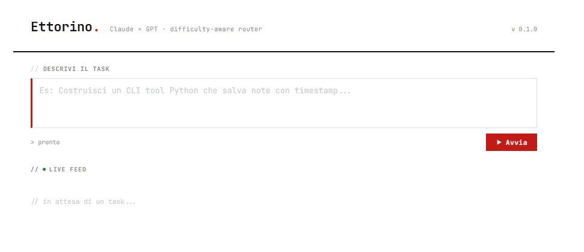
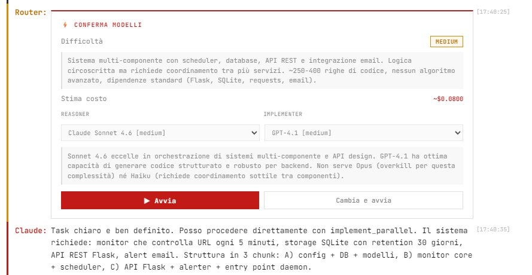
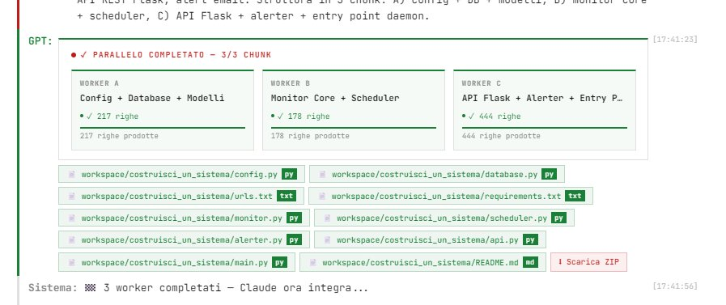

# Ettorino 🟠

**An AI agent that thinks, plans and builds software — in parallel.**

Claude reasons. GPT implements. Ettorino orchestrates everything.



---

## What happens when you run a task

```
You →  "Build a web application monitoring system with daemon process,
        SQLite storage, Flask REST API, email alerts and YAML config"

         ┌─────────────────────────────────────────────────────┐
         │                     ETTORINO                        │
         │                                                     │
         │  1. Router classifies → HARD                        │
         │  2. Proposes models + cost estimate → you confirm   │
         │                                                     │
         │  3. Claude Opus 4.7 (Architect)                     │
         │     "Splitting into 3 parallelizable chunks..."     │
         │                                                     │
         │  ┌──────────┐  ┌──────────┐  ┌──────────┐         │
         │  │ GPT-4.1  │  │ GPT-4.1  │  │ GPT-4.1  │         │
         │  │ Chunk A  │  │ Chunk B  │  │ Chunk C  │         │
         │  │config+db │  │monitor+  │  │api+daemon│         │
         │  │          │  │alerter   │  │          │         │
         │  └────┬─────┘  └────┬─────┘  └────┬─────┘         │
         │       └─────────────┴─────────────┘               │
         │                     │                              │
         │  4. Claude Integrator checks coherence             │
         │     imports, naming, interfaces → ✓ done           │
         └─────────────────────────────────────────────────────┘

→  workspace/build_a_web_application/   (8 files ready)
   webmon/__init__.py
   webmon/config.py
   webmon/database.py
   webmon/monitor.py
   webmon/alerter.py
   webmon/api.py
   webmon/daemon.py
   config.example.yaml
```

---

## Screenshots

### Clean interface
Minimal terminal-style UI — JetBrains Mono throughout, log rows with left-border accents per agent, timestamps on every line.


### Routing & model selection
The router classifies the task difficulty and proposes the optimal model pair. You can swap either model before the loop starts. Includes cost estimate and reasoning.



### Parallel execution
On hard tasks, up to 6 implementer workers run simultaneously. Each worker card shows its own live progress bar with token and line counters streaming in real time.



---

## Features

| | |
|---|---|
| 🧠 **Smart router** | Classifies every task (easy/medium/hard) and selects optimal models for quality/cost |
| ⚡ **Parallel implementation** | Up to 6 GPT workers run simultaneously, wave-scheduled via dependency graph |
| 📊 **Per-worker live bars** | Each parallel worker streams its own token/line counter in real time |
| 💬 **Conversational loop** | Claude asks for clarification when needed, without blocking |
| 🔄 **Continue the conversation** | After completion, request changes — restarts with fresh classification |
| 🛑 **Stop anytime** | Floating button, interrupts the loop without losing context |
| 💰 **Real-time cost tracking** | Tokens and dollars per model, updated live during execution |
| 📁 **Multi-file structure** | Code saved in the exact folder structure planned by Claude |
| ⬇️ **Direct download** | Download the project as a `.zip` at the end of each run |
| 🔁 **Auto-continuation** | If output is truncated, resumes automatically (up to 3 attempts) |
| 🌍 **EN / IT localization** | Full interface translation, language preference persisted in localStorage |
| 🌙 **Dark mode** | One click, persisted in localStorage |
| 💡 **Task examples** | Built-in easy/medium/hard examples to get started quickly |
| 🐳 **Container-ready** | Multi-stage Chainguard image, runs anywhere with Docker |

---

## Models

| Tier | Reasoner | Implementer | When |
|------|----------|-------------|------|
| 🟢 **Easy** | Claude Haiku 4.5 | GPT-4.1 mini | Scripts, utilities, single functions |
| 🟡 **Medium** | Claude Sonnet 4.6 | GPT-4.1 | Multi-component apps, APIs, 100–500 lines |
| 🟠 **Hard-mid** | Claude Opus 4.6 | GPT-4.1 | Complex systems, multi-file architectures |
| 🔴 **Hard** | Claude Opus 4.7 | o3 | Very complex systems, ML/AI, 600+ lines |

The classifier always uses **Claude Sonnet 4.6** regardless of tier (cost < $0.01).

---

## Parallel execution — how it works

On hard/hard-mid tasks Claude decides how many chunks to produce (2–6) and whether they have dependencies. The executor runs them in **topological waves**: independent chunks run in parallel, dependent chunks wait for their prerequisites.

```
Claude decides:
  Chunk A — foundations (config, db, models)      → no deps
  Chunk B — core logic (monitor, scheduler)        → depends on A
  Chunk C — external interfaces (API, alerter)     → depends on A

Execution:
  Wave 1: [A]           ← runs alone (is a prerequisite)
  Wave 2: [B, C]        ← run in parallel once A is done
```

Each worker streams its progress live. If a chunk marked `is_critical` fails, the wave is cancelled immediately.

---

## Estimated costs

| Task | Cost |
|------|------|
| "Write a Python function that..." | ~$0.002 |
| "Build a CLI with 4 commands..." | ~$0.05–0.15 |
| "Multi-component monitoring system..." | ~$0.50–2.00 |
| "6-worker parallel system, hard task" | ~$1.50–5.00 |

---

## Installation

### Option A — Python (local dev)

**Prerequisites:** Python 3.10+, Anthropic and OpenAI API keys

```bash
# 1. Install dependencies
pip install flask anthropic openai python-dotenv gunicorn

# 2. Set your keys in .env
ANTHROPIC_API_KEY=sk-ant-...
OPENAI_API_KEY=sk-...
ETTORINO_VERSION=0.1.0

# 3. Run
python ettorino_assistant.py
```

Open **http://localhost:5000** — Ettorino does the rest.

---

### Option B — Docker

**Prerequisites:** Docker, Anthropic and OpenAI API keys

```bash
# 1. Clone and enter the repo
git clone <repo-url> && cd ettorino

# 2. Create your .env (never committed — used only by docker compose)
cat > .env << EOF
ANTHROPIC_API_KEY=sk-ant-...
OPENAI_API_KEY=sk-...
ETTORINO_VERSION=0.1.0
EOF

# 3. Build and run
docker compose up --build
```

Open **http://localhost:8080**

The `workspace/` folder is persisted in a named Docker volume (`ettorino_workspace`) so generated projects survive container restarts.

#### Manual docker run (without compose)

```bash
docker build -t ettorino .
docker run -p 8080:5000 \
  -e ANTHROPIC_API_KEY=sk-ant-... \
  -e OPENAI_API_KEY=sk-... \
  -v ettorino_workspace:/app/workspace \
  ettorino
```

> **Why `-w 1`?** The agent loop uses in-memory state per session (`event_queues`, `session_costs`, `human_responses`). Multiple workers = isolated processes = broken sessions. One worker + 16 threads handles all concurrent requests safely.

> **Port note:** avoid port 6000 — Chrome and Edge block it (`ERR_UNSAFE_PORT`). Use 8080, 8888, or any port ≥ 1024 not in the browser unsafe list.

---

## Project structure

```
ettorino/
├── ettorino_assistant.py   ← Flask backend + agent engine + parallel loop
├── templates/
│   └── index.html          ← UI: terminal aesthetic, i18n, dark mode, parallel dashboard
├── workspace/              ← generated projects, organized by task slug
│   └── build_a_web_/
│       ├── webmon/
│       └── config.yaml
├── docs/
│   ├── screen_ui.png
│   ├── screen_confirm.png
│   └── screen_parallel.png
├── Dockerfile              ← multi-stage Chainguard build (no shell in runtime)
├── docker-compose.yml      ← ports, env vars, workspace volume
├── requirements.txt
├── .env                    ← keys and configuration (do not commit)
├── .dockerignore
└── .gitignore
```

---

## Configuration (.env)

```env
# Required
ANTHROPIC_API_KEY=sk-ant-...
OPENAI_API_KEY=sk-...

# Optional
ETTORINO_VERSION=0.1.0    # shown in the UI
FLASK_PORT=5000
FLASK_DEBUG=true
MAX_ITERATIONS=10          # max loop iterations per task
HUMAN_TIMEOUT=300          # seconds before timeout on user response
```

---

## Internal architecture

```
POST /run
  │
  ├── classify_task()           Claude Sonnet 4.6 → easy/medium/hard-mid/hard
  │
  ├── [model confirm UI]        user can swap models before the loop starts
  │
  └── run_agent_loop()
        │
        ├── claude_reason()     Claude streams reasoning (only "thoughts" shown in UI)
        │     │
        │     ├── implement          → run_implementer() sequential
        │     ├── implement_parallel → run_implementer_parallel() × 2–6 workers
        │     │                        ChunkManager.execution_waves() → topological sort
        │     │                        each worker streams parallel_chunk_stream events
        │     ├── fix               → run_implementer() with corrective feedback
        │     ├── ask               → waits for user input via SSE
        │     └── done              → saves state, emits loop_end
        │
        └── [continue?]         /continue → reclassifies + new model confirm card
```

All events travel over **Server-Sent Events (SSE)** — no polling, no websockets.

---

## Production

```bash
# Local
gunicorn -w 1 --threads 16 --timeout 600 ettorino_assistant:app

# Docker (recommended)
docker compose up -d
```

---

## Roadmap

- [ ] GPT-5 support when available via standard API
- [ ] Automatic quality/cost benchmark per task
- [ ] Session persistence on Redis (enables multi-worker scaling)
- [ ] One-click deploy on Railway / Render
- [ ] Plugin system for external tools (browser, terminal, git)